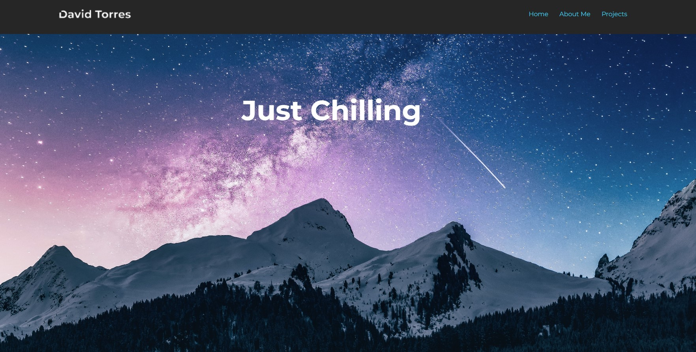

# CSS & HTML Portfolio
Portfolio in HTML &amp; CSS

## Folder Structure 🗺️:
Inside the "Assets" folder you'll find:
- Images 
    - Images used for the project
- Styling
    - style.css

## Concepts Applied 🧐:
- [x] HTML 🦴

- [x] Advanced CSS 🎨

- [x] UX 🤔

## Web Page Link 😏
<a href="https://davidtc8.github.io/CSS-HTML-Portfolio/" 
target="_blank">Webpage!</a>

## Screenshot:
